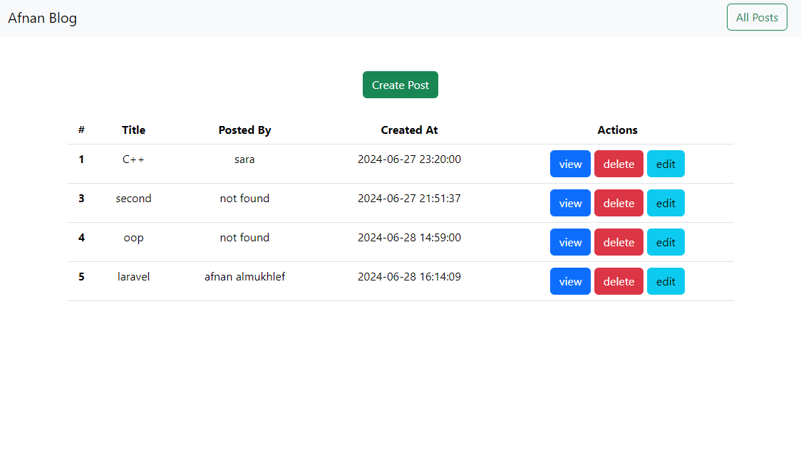
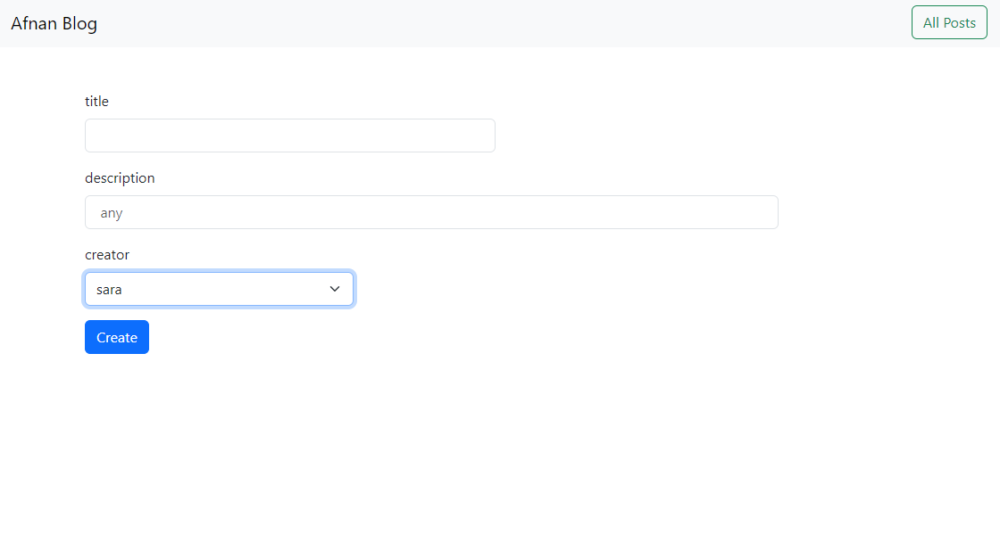
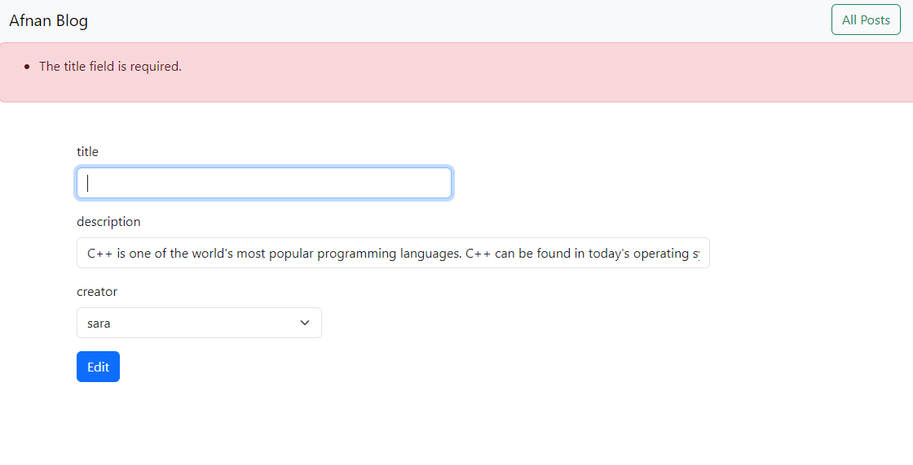
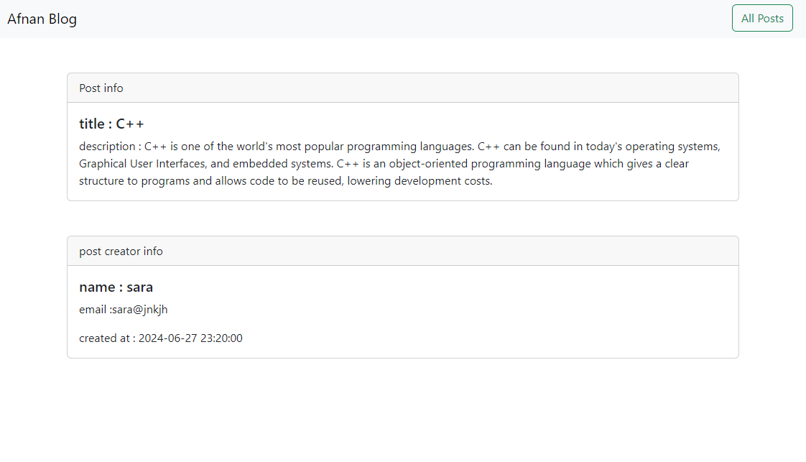

# Blog Website

A simple blog website built with Laravel PHP, allowing users to create, edit, view, and delete posts. Each post includes a title, description, and the creator's name. The project is connected to an SQLite database, managed through phpMyAdmin, and runs on an Apache server.

## Features

- **Create Post**: Users can create a new blog post by providing a title, description, and creator's name.
- **Edit Post**: Existing posts can be updated.
- **View Posts**: All posts can be viewed individually, showcasing their details.
- **Delete Post**: Users can delete posts.
- **Responsive UI**: The website layout adapts to different screen sizes.
- **Error Handling**: The app displays appropriate error messages during validation or unexpected issues.
- **Debugging**: Installed debugging tools for troubleshooting.

## Tech Stack

- **Backend**: Laravel PHP Framework
- **Database**: SQLite (via phpMyAdmin)
- **Server**: Apache
- **Frontend**: HTML, CSS, Blade Templating
- **Debugging**: Laravel Debugbar for enhanced debugging.


## Usage

1. Navigate to the home page to view all blog posts.
2. Click "Create Post" to add a new blog entry.
3. Use the "Edit" button to modify a post.
4. Use the "Delete" button to remove a post.
5. Check the Debugbar for detailed debugging information during development.

## Error Handling

- **Validation Errors**: When creating or editing a post, if the title, description, or creator's name fields are missing or invalid, the app will display specific error messages.

- **Database Errors**: If there are issues connecting to the SQLite database, an appropriate error message is shown.
  
  

## Screenshots






## Debugging

This project includes **Laravel Debugbar**, which provides detailed information about the application during development. You can find insights such as:

- Queries executed
- Time taken for each process
- Variables and request data
- Logging

You can view the debug information at the bottom of the browser while the application is running.


---
## how to run :
- download xxamp and open apache and sqlite servers
- Create a database locally named `laravel` in phpmyadmin
- Download composer https://getcomposer.org/download/
- clone or Pull Laravel/php project from github.
- Rename `.env.example` file to `.env`inside your project root and fill the database information.
  (windows wont let you do it, so you have to open your console cd your project root directory and run `mv .env.example .env` )
- Open the console and cd your project root directory
- Run `composer install` or ```php composer.phar install```
- Run `php artisan key:generate` 
- Run `php artisan migrate`
- Run `php artisan db:seed` to run seeders, if any.
- Run `php artisan serve`

### You can now access website at localhost:8000/posts
if any issues , follow this article [How to Run an Existing Laravel Project](https://mumin-ahmod.medium.com/how-to-run-an-existing-laravel-project-f99a70c0f112)